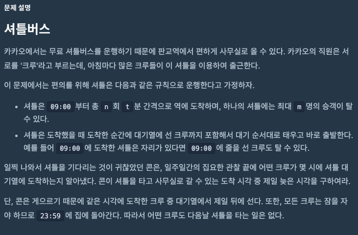
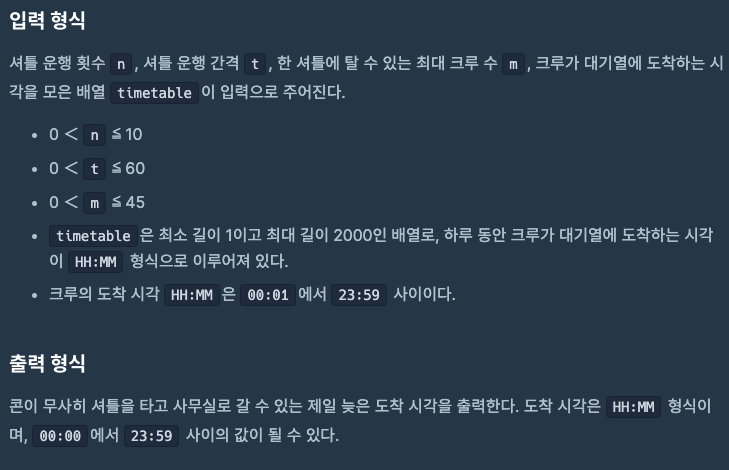

# 문제설명





# 접근 방법

LinkedList를 활용하여 FIFO(선입선출)로 접근을 했습니다.

먼저 “HH:MM”형태인 timetable을 Integer로 형 변환 그리고 답을 위한 String형 변환 함수를 만들었습니다.

```java
    public int timeParser(String time){
        String[] timeS = time.split(":");
        int timeM = (Integer.parseInt(timeS[0]) * 60) + Integer.parseInt(timeS[1]);
        return timeM;
    }
    
    public String timeParser2(int time){
        int hour = (int)(time / 60);
        int minute = (int)(time % 60);
        String hourS = "";
        String minuteS = "";
        
        if (hour < 10){
            hourS = "0" + Integer.toString(hour);
        }
        else{
            hourS = Integer.toString(hour);
        }
        
        if (minute < 10){
            minuteS = "0" + Integer.toString(minute);
        }
        else{
            minuteS = Integer.toString(minute);
        }

        String timeS = hourS + ":" + minuteS;
        
        return timeS;
    }
```

이후 09:00에 첫 버스가 오고, 입력값인 n과 t를 활용해서 버스 시간표를 만들었습니다.

```java
   public Queue<Integer> createBusTable(int n, int t){
        Queue<Integer> busTable = new LinkedList<>();
        int startTime = timeParser("9:00");
        busTable.add(startTime);

        for (int i = 1; i < n; i++){
            int time = startTime + (i * t);
            busTable.add(time);
        }

        return busTable;
    }
```

그리고 크루들의 줄 서는 시간, 버스 시간표를 다시한번 정렬을 해주었습니다.

```java
        List<Integer> sortedCrewList = new LinkedList<>(crewTable);
        Collections.sort(sortedCrewList);
        crewTable.clear();
        crewTable.addAll(sortedCrewList);

        List<Integer> sortedBusList = new LinkedList<>(busTable);
        Collections.sort(sortedBusList);
        busTable.clear();
        busTable.addAll(sortedBusList);
```

마지막으로 문제의 핵심인 콘이 탈 수 있는 가장 늦은 시간을 구했습니다.

1. 버스가 없을때의 조건으로 첫 반복문을 만들어 주고, 자리가 있고, 크루원들이 버스도착시간보다 먼저 기다리고 있을때의 조건으로 반복문을 설정하여 최대한 늦은 시간을 먼저 찾아줍니다.
2. 다음 조건으로는 버스가 마지막 버스이고, 자리가 있다면 해당 버스시간이 콘이 탑승 할 수 있는 가장 늦은 시간이고
3. 또는  버스가 마지막 버스이고, 자리가 없다면 크루원보다 빠르게 탑승해야하기때문에 1분 먼저 오도록 진행해 주었습니다.

```java
    public String latestTimeCheck(Queue<Integer> busTable, Queue<Integer> crewTable, int m) {
        int latestTime = 0;

        while (!busTable.isEmpty()) {
            int currentBus = busTable.poll();
            int seatsAvailable = m;

            while (seatsAvailable > 0 && !crewTable.isEmpty() && crewTable.peek() <= currentBus) {
                latestTime = crewTable.poll();
                seatsAvailable--;
            }

            if (busTable.isEmpty() && seatsAvailable > 0) {
                latestTime = currentBus;
            }
            else if (busTable.isEmpty() && seatsAvailable == 0) {
                latestTime--;
            }
        }

        return timeParser2(latestTime);
    }
```

# 느낀점

크루원들과 같은 시간이라면 콘이 가장 늦게 도착한다는 조건때문에 조건 설정에 조금의 어려움이 있었습니다.

# 내 전체 코드

```java
import java.util.Arrays;
import java.util.Queue;
import java.util.LinkedList;
import java.util.Collections;
import java.util.List;

class Solution {
    public static void main(String[] args){
        Solution my = new Solution();
        // TCs
		// int n = 1;		//TC #1
		// int t = 1;		//TC #1
		// int m = 5;		//TC #1
		// String[] timetable = {"08:00", "08:01", "08:02", "08:03"};		//TC #1
		// int n = 2;		//TC #2
		// int t = 10;		//TC #2
		// int m = 2;		//TC #2
		// String[] timetable = {"09:10", "09:09", "08:00"};		//TC #2
		// int n = 2;		//TC #3
		// int t = 1;		//TC #3
		// int m = 2;		//TC #3
		// String[] timetable = {"09:00", "09:00", "09:00", "09:00"};		//TC #3
		// int n = 1;		//TC #4
		// int t = 1;		//TC #4
		// int m = 5;		//TC #4
		// String[] timetable = {"00:01", "00:01", "00:01", "00:01", "00:01"};		//TC #4
		// int n = 1;		//TC #5
		// int t = 1;		//TC #5
		// int m = 1;		//TC #5
		// String[] timetable = {"23:59"};		//TC #5
		int n = 10;		//TC #6
		int t = 60;		//TC #6
		int m = 45;		//TC #6
		String[] timetable = {"23:59","23:59", "23:59", "23:59", "23:59", "23:59", "23:59", "23:59", "23:59", "23:59", "23:59", "23:59", "23:59", "23:59", "23:59", "23:59"};		//TC #6

        // Solution output
		String output = my.solution(n, t, m, timetable);
		System.out.println(output);
    }
    public String solution(int n, int t, int m, String[] timetable) {
        String answer;
        Queue<Integer> crewTable = new LinkedList<>();
        Queue<Integer> busTable = new LinkedList<>();

        for (int i = 0; i < timetable.length; i++){
            crewTable.add(timeParser(timetable[i]));
        }
        busTable = createBusTable(n, t);

        List<Integer> sortedCrewList = new LinkedList<>(crewTable);
        Collections.sort(sortedCrewList);
        crewTable.clear();
        crewTable.addAll(sortedCrewList);

        List<Integer> sortedBusList = new LinkedList<>(busTable);
        Collections.sort(sortedBusList);
        busTable.clear();
        busTable.addAll(sortedBusList);

        System.out.println(crewTable);
        System.out.println(busTable);

        answer = latestTimeCheck(busTable, crewTable, m);
        
        return answer;
    }
    public String latestTimeCheck(Queue<Integer> busTable, Queue<Integer> crewTable, int m) {
        int latestTime = 0;

        while (!busTable.isEmpty()) {
            int currentBus = busTable.poll();
            int seatsAvailable = m;

            while (seatsAvailable > 0 && !crewTable.isEmpty() && crewTable.peek() <= currentBus) {
                latestTime = crewTable.poll();
                seatsAvailable--;
            }

            if (busTable.isEmpty() && seatsAvailable > 0) {
                latestTime = currentBus;
            }
            else if (busTable.isEmpty() && seatsAvailable == 0) {
                latestTime--;
            }
        }

        return timeParser2(latestTime);
    }

    public Queue<Integer> createBusTable(int n, int t){
        Queue<Integer> busTable = new LinkedList<>();
        int startTime = timeParser("9:00");
        busTable.add(startTime);

        for (int i = 1; i < n; i++){
            int time = startTime + (i * t);
            busTable.add(time);
        }

        return busTable;
    }
    public int timeParser(String time){
        String[] timeS = time.split(":");
        int timeM = (Integer.parseInt(timeS[0]) * 60) + Integer.parseInt(timeS[1]);
        return timeM;
    }
    public String timeParser2(int time){
        int hour = (int)(time / 60);
        int minute = (int)(time % 60);
        String hourS = "";
        String minuteS = "";
        
        if (hour < 10){
            hourS = "0" + Integer.toString(hour);
        }
        else{
            hourS = Integer.toString(hour);
        }
        
        if (minute < 10){
            minuteS = "0" + Integer.toString(minute);
        }
        else{
            minuteS = Integer.toString(minute);
        }

        String timeS = hourS + ":" + minuteS;
        
        return timeS;
    }
}
```