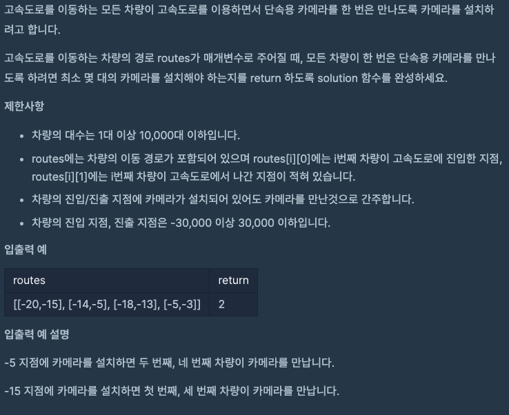

# 문제 설명



# 접근 방법

1. routes의 범위내에 모든 경우의 수를 확인하고 check Flag를 만들어 개수를 세려고 했지만, 차양은 10000대 이하고, 진입 진출 지점의 범위는 60000이기 때문에 효울성이 안나올 것으로 생각했습니다.
2. 진출지점은 그 구간의 끝을 의미하는 것이기 때문에 정렬을 해주고, 다음 route의 시작지점이 전 route의 끝지점보다 작다면 단속카메라를 설치하지 않아도 되는점을 이용했습니다.

# 느낀점

범위가 나오는 문제는 대부분 그래프 또는 정렬을 통해서 단순화 할 수 있는 것 같습니다.

# 전체 코드

```java
import java.util.Arrays;

class Solution {
    public static void main(String[] args){
        Solution my = new Solution();
        // TCs
		int[][] routes = {{-20,-15}, {-14,-5}, {-18,-13}, {-5,-3}};		//TC #1

        // Solution output
		int output = my.solution(routes);
		System.out.println(output);
    }
    public int solution(int[][] routes) {
        int answer = 0;
        int camera = -30001;

        Arrays.sort(routes, (o1, o2) -> {
            return o1[1]-o2[1];
        });

        for(int i = 0; i < routes.length; i++){
            if(camera < routes[i][0]){
                answer += 1;
                camera = routes[i][1];
            }
        }

        return answer;
    }
}
```